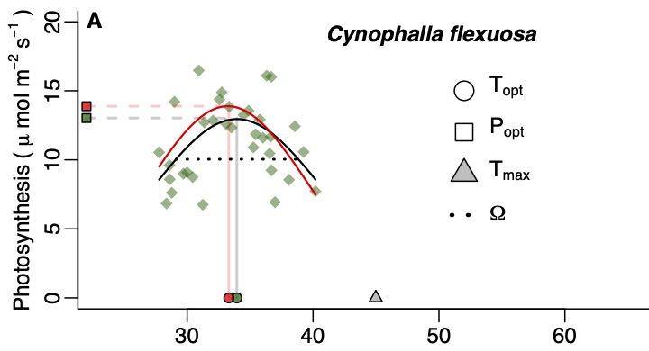
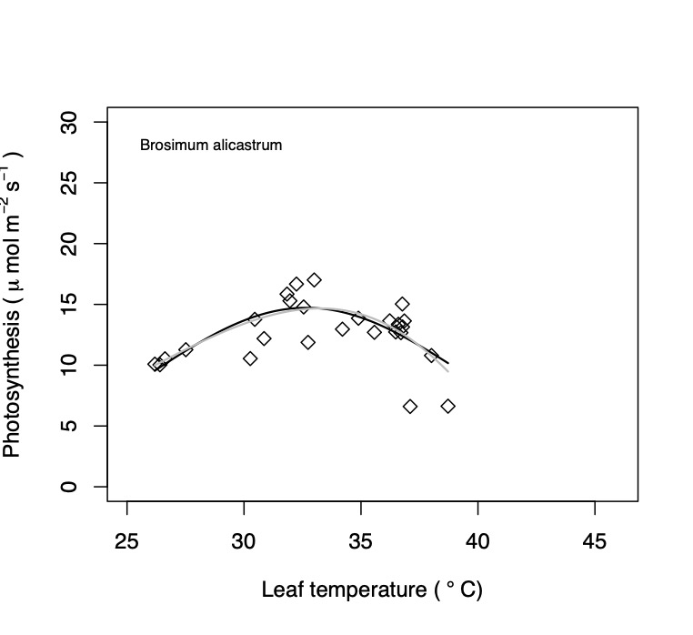

---
authors:
- admin
categories:

date: ""
draft: false
featured: false
image:
  focal_point: ""
  placement: 2
  preview_only: false
lastmod: "2021-04-13T00:00:00Z"
projects: []
subtitle: 
summary: 
tags:

title: "R code for modelling photosynthetic temperature-assimilation curves"
---

## Overview
Photosynthetic carbon assimilation tends to follow a unimodal response to temperature. In other words, carbon assimilation increases from a low temperature, peaks at some optimal temperature, then declines at high temperatures. Different parameters that describe the shape of modelled temperature-assimilation (AT) curves may be useful for understanding how plant are adapted to their environments. For some more background on AT curves, check out this publication:
* [Photosystem II heat tolerances characterize thermal generalists and the upper limit of carbon assimilation]( "Photosystem II heat tolerances characterize thermal generalists and the upper limit of carbon assimilation") 

Here is a [link to GitHub repository](https://github.com/tmoreperez/AT_Curve_function) with some sample temperature and assimilation data, and an R code for a function that can be used to calculate the  maximum rate of photosynthesis (Popt) that occurs at some optimum temperature (Topt), and a metric that describes the breadth of the AT curve ('Omega'). Another parameter, Tmax indicates the high temperature at which carbon assimilation approaches zero is also produced by the function code. 

There are two different models that are used to estimate these parameters. The paper linked above provides details on the different equations that are used. Parameters other than those listed above can be obtained from these equations. However, the function currently only provides output for estimates of Popt, Topt, Omega, and Tmax. The function also includes an option to produce a basic plot of the data. 

*This is an example of the figure that is produced from the function. Each point represents a different leaf for one species (Brosimum alicastrum in this case). The 'Photosynthesis' on the y-axis indicates the amount of carbon assimilated at a given temperature. The two curves in each figure represent the two different equations provided in the paper linked above.*
