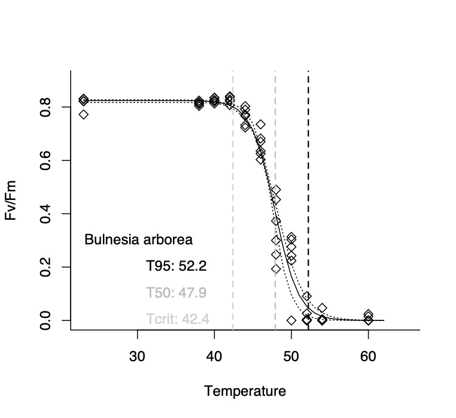

---
authors:
- admin
categories:

date: "2020-12-13T00:00:00Z"
draft: false
featured: false
image:
  focal_point: ""
  placement: 2
  preview_only: false
lastmod: "2021-04-13T00:00:00Z"
projects: []
subtitle: 
summary: 
tags:

title: R code for estimating the heat tolerances of photosystem II photochemistry
---

## Overview
For background on what photosystem II (PSII) is and why the heat tolerance of PSII is of potential interest for plant ecologists, check out these links to some of my publications:
* [Photosystem II heat tolerances characterize thermal generalists and the upper limit of carbon assimilation]({{ ref "publication/PCE.2021/index.md" }} "Photosystem II heat tolerances characterize thermal generalists and the upper limit of carbon assimilation") 
* [Photosynthetic heat tolerances and extreme leaf temperatures]( "Photosynthetic heat tolerances and extreme leaf temperatures")

The links above will also provide details on how to collect the data needed to estimate PSII heat tolerances. Of course, I'm always reachable by email to address any questions.   

Here is a [link to GitHub repository](https://github.com/tmoreperez/Heat_tolerance_function)  with some sample data and R code that can be used to calculate three different estimates of heat tolerance for PSII (Tcrit, T50, and T95). The input for the function only requires that a user defines the the columns of a data frame with the 1) Temperature & 2) FvFm variables, then the 3) control temperature, the 4) id/unique factor that you want to estimate the heat tolerances for, 5) a T/F statement to indicate if you want to make plots, and 6) the number of bootstrap iterations for estimating heat tolerances. The three different estimates of PSII heat tolerance are output into a dataframe.  

Below is an example of the figure that is produced from the function. It's really basic, and not really publication-quality as is, but it effectively illustrates the data and the estimates of the heat tolerance data.

   

